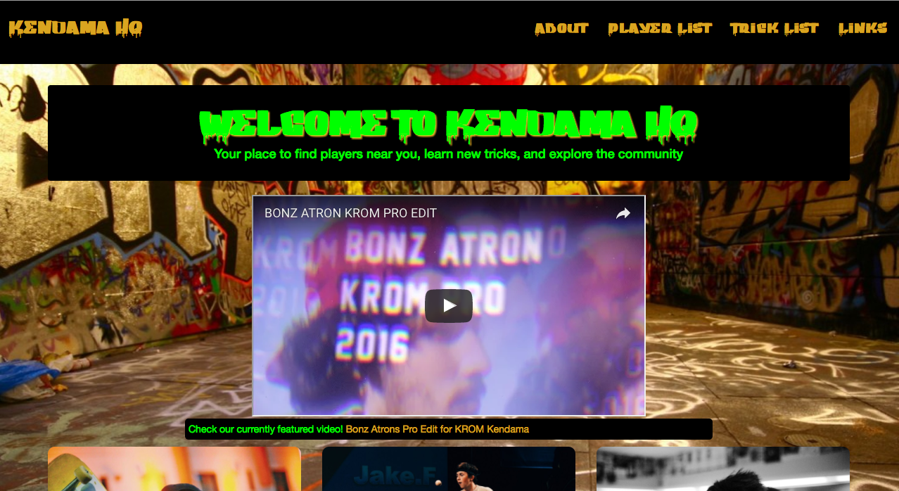
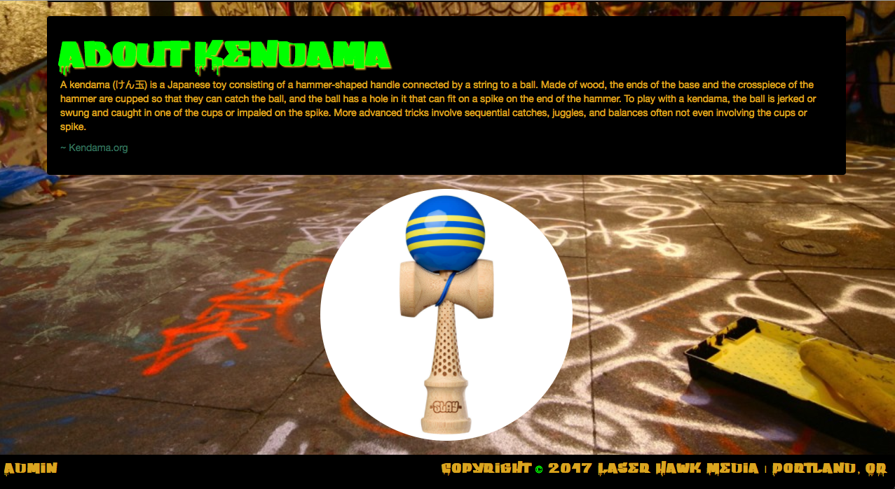
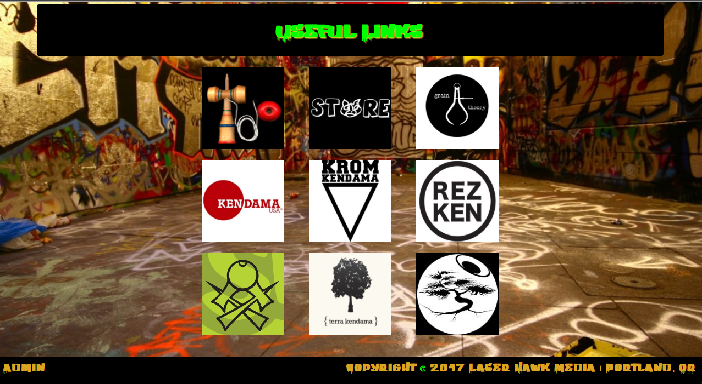
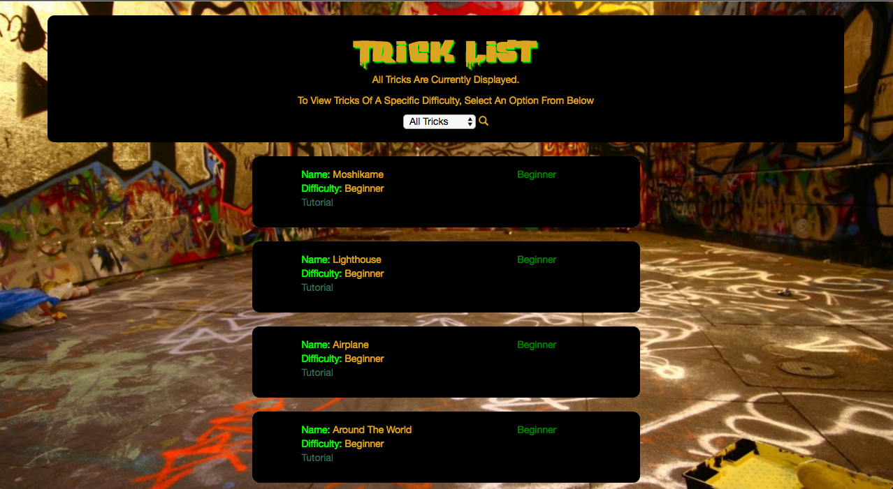

<!-- # KendamaClubWeek4js

This project was generated with [Angular CLI](https://github.com/angular/angular-cli) version 1.0.0.

## Development server

Run `ng serve` for a dev server. Navigate to `http://localhost:4200/`. The app will automatically reload if you change any of the source files.

## Code scaffolding

Run `ng generate component component-name` to generate a new component. You can also use `ng generate directive/pipe/service/class/module`.

## Build

Run `ng build` to build the project. The build artifacts will be stored in the `dist/` directory. Use the `-prod` flag for a production build.

## Running unit tests

Run `ng test` to execute the unit tests via [Karma](https://karma-runner.github.io).

## Running end-to-end tests

Run `ng e2e` to execute the end-to-end tests via [Protractor](http://www.protractortest.org/).
Before running the tests make sure you are serving the app via `ng serve`.

## Further help

To get more help on the Angular CLI use `ng help` or go check out the [Angular CLI README](https://github.com/angular/angular-cli/blob/master/README.md). -->
# _Kendama HQ!_
  

    
  

#### _Nerds Unite! An application for Kendama Players to keep track of their peers, as well as learn more about the game they love. Made with Angular2   5-5-17_

#### By _**Evan Bishop**_

## Planning

1. Configuration/dependencies

  * Typescript is installed globally
  * Angular2 is installed
  * Node.js is installed globally and modules are included when project is initiated with Angular2
  * Bower is a front-end dependency manager that is installed globally and initiated after project directory is created
  * Bootstrap is a collection of CSS that is installed with Bower, and manually added in angular-cli.json

2. Integration

  * Initiate Project With Angular2
    Generate:
  * welcome component
  * about component
  * admin component
  * links component
  * users-display-list component
  * user-detail component
  * edit-user component
  * user model
  * user service

3. UX/UI

  * Install Bootstrap with Bower

4. Polish

  * Clean up indentation and formatting
  * DRY up code where applicable
  * Make README awesome

5. Ideas For Possible Future Functionality

  * Use YouTube API to include Kendama Channels in the application
  * Use Reddit API to incude posts from the r/Kendama subreddit
  * Filter list of players various ways
    * Skill Ratings
    * Alphabetically
    * Age
    * Location

## Description

_Have you ever been playing Kendama and thought to yourself, "I wish I had a badass profile on a webpage somewhere that showed everyone how Kewl I know I am." Your dreams have come true. With the advent of the Kendama HQ Technology, now everyone can have their own profile page to showcase their sweet skills, or just find new friends!
 
 
The application allows users to view a list of all Kendama players in the system, as well as view a list of tricks that is filterable by difficulty. Simply click on one of the players listed, and you will be taken to their profile page!
 
 
As an Admin, you are allowed to add new users to the system, as well as edit and delete currently existing players.
 
 
Other functionality includes an 'About' page if you are new to Kendama and wondering what the hell it is, as well as a 'Links' page to allow you to explore further._

<!-- | Behavior | Input Example  | Output Example  |
|---|---|---|
|  |  |  |
|  |  |  |
|  |  |  |
|  |  |  | -->

  

  

  

  

## Setup/Installation Requirements

* Install Angular2 https://v2.angular.io/docs/ts/latest/
* Install Node.js https://nodejs.org/en/
* Install Bower https://bower.io/
* Download this repository: https://github.com/EB888/kendama-hq-week4js.git
* In in the src/app/ directory of the Kendama HQ application, create a file called 'api-key.ts'
* Copy this code into that file: `export var masterFirebaseConfig = {};`
* Create an account at https://firebase.google.com/
* Click on 'Go to Console' in the upper right corner of firebase
* Click 'Add project' and name it whatever you like
* Next click on 'Add firebase to your Web App' to see a popup with important information
* Copy ONLY the part of 'var config = {}' that is INSIDE the curly braces. Everything inside the curly braces. Nothing outside.
* In between the Curly Braces in `export var masterFirebaseConfig = {};`, paste your the information from Firebase. Save the file.
* In the top level of this project directory (downloaded from Github), in Terminal, enter these commands:
 
`npm install`
 
&
 
`bower install`
* Next enter the command
 
`ng serve`
 
* A server will begin running at `localhost:4200`
* In your web browser enter the URL `localhost:4200` to see the page
* Add, edit, and delete individual players! Look up tricks! Experiment and have fun.
* Finally, notify me of any bugs : (

<!-- _{Leave nothing to chance! You want it to be easy for potential users, employers and collaborators to run your app. Do I need to run a server? How should I set up my databases? Is there other code this app depends on?}_ -->

## Known Bugs

There are currently no known bugs

<!-- _{Are there issues that have not yet been resolved that you want to let users know you know?  Outline any issues that would impact use of your application.  Share any workarounds that are in place. }_ -->

## Support and contact details

<!-- _{Let people know what to do if they run into any issues or have questions, ideas or concerns.  Encourage them to contact you or make a contribution to the code.}_ -->

## Technologies Used

* Angular2 https://v2.angular.io/docs/ts/latest/
* Typescript http://www.typescriptlang.org/
* Node.js https://nodejs.org/en/
* Bower https://bower.io/
* Bootstrap CSS http://getbootstrap.com/css/

<!-- _{Tell me about the languages and tools you used to create this app. Assume that I know you probably used HTML and CSS. If you did something really cool using only HTML, point that out.}_ -->

### License

<!-- *{Determine the license under which this application can be used.  See below for more details on licensing.}* -->

Copyright (c) 2017 **_Evan Bishop_**
